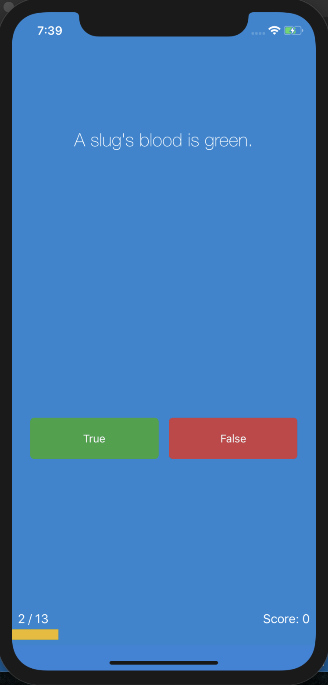
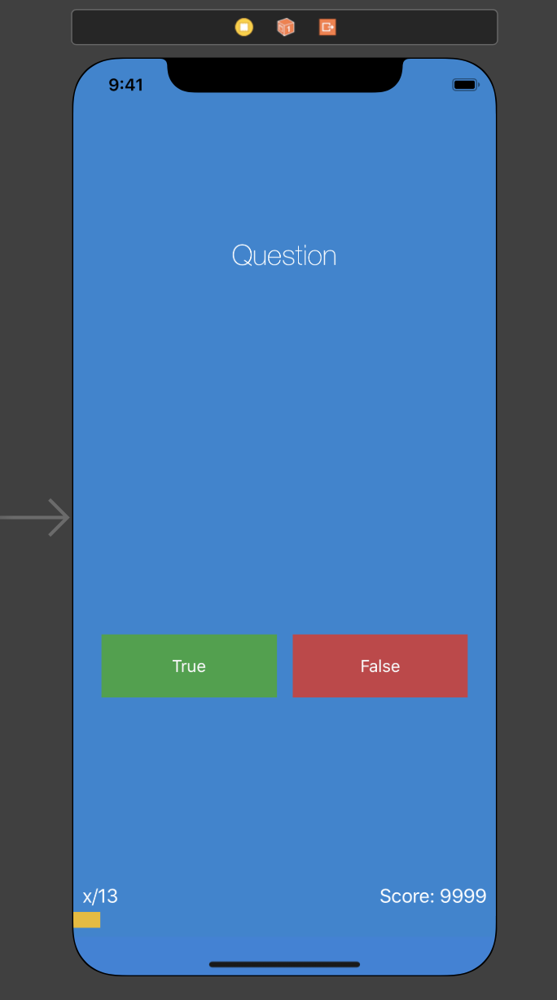

#  Quizzler

This simple IOS app is a quiz with 13 unique questions about the world. The objective is to answer all the questions correctly and retake the quiz if you missed one or a few. 
Standard quiz app built on IOS using ProgressHUD. 

Simple page app image below:



# Getting Started 

After the app is loaded it will display the page above and after clicking on an answer, questions will change and result shown after user clicked on answer. The user's points will be scored and shown at the bottom of the screen, the progress bar will update when the user clicks on the correct answer. 

# Built With
- Swift
- Objective - C
- ProgressHUD
- UiKit

# App Icon Logo 


# Wireframe Layout 
Below the storyboard for this project is shown: 



# Code-Snippets

### Questions Array

The object class below is used when a new item is added to an array, each question will contain the question and the answer. 
```
class Question {
    
    let questionText : String
    let answer : Bool
    
    init(text: String, correctAnswer: Bool) {
        questionText = text
        answer = correctAnswer
    }
}
```
The code blow is where I create a new array and an example of appending or adding a new question to the list array with the requirements of the class I created earlier with the question and answer. 
```
var list = [Question]()

list.append(Question(text: "A slug\'s blood is green.", correctAnswer: true))
```

The function below shows how I use ProgressHUD to display to the user if the answer if correct or wrong. We check the user's answer with the real answer in the array. 
```
func checkAnswer() {
    
    let correctAnswer = allQuestions.list[questionNumber].answer
    
    if(correctAnswer == pickedAnswer)
    {
        ProgressHUD.showSuccess("Correct")
        
        score += 1
    }
    else
    {
        ProgressHUD.showError("Wrong!")
    }
}
```

# Author
* **Muhammad** - https://github.com/mawais54013

